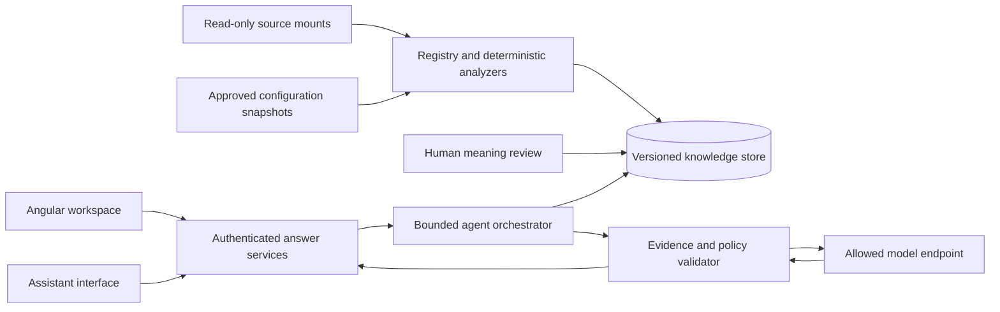

# CodeAtlas — Enterprise Code Knowledge & Change Intelligence Platform

> Build specification and implementation brief for Claude Code. Understand a business process, assess a proposed change, and inspect the software evidence behind every answer.

## 1. Authority, objective, and delivery constraints

This SRS operationalizes the company **Enterprise Code Knowledge Platform BRD v1.1, dated 4 September 2026**, supplied in `Mazhar_Ibna_Zahur_2378_Enterprise_Code_Knowle_Mazhar Ibna Zahur 23.pdf`, and its accompanying architecture PNG. The company BRD is authoritative if this specification conflicts with it. Original requirement IDs are retained in section 15.

**Product objective:** turn registered software into connected structural knowledge, reviewed business meaning, and process behaviour, with evidence-backed services for people and AI assistants.

**Delivery context:** seven hours, one human developer assisted by Claude Code; Angular frontend and Spring Boot backend. Build a runnable vertical slice first, then expand coverage. This document covers the entire company scope; it does not claim every requirement can be implemented or validated within seven hours.

**Hardware uncertainty:** 32 GB system RAM was reported; GPU count/topology remains unconfirmed. Do not make distributed GPU serving a dependency. A local model endpoint is optional infrastructure until configured and verified.

Two explicit deployment profiles:

- `demo`: synthetic/public repositories only; OpenRouter may be enabled. Display “Synthetic demo data — external inference enabled” when applicable.
- `enterprise`: source, embeddings, source-derived summaries, prompts, and answers remain within the enterprise boundary; only approved local inference endpoints are allowed. Fail startup or requests on an external inference configuration. Never silently fall back to cloud.

A cloud-backed demo does **not** satisfy NFR-10. A checklist must report each requirement as `implemented`, `verified`, `partial`, or `not implemented`, with evidence. Never equate a mock, screenshot, interface stub, or roadmap item with completed functionality.

## 2. Product proposition and boundaries

### 2.1 Primary experience

A user asks: “If the purchase approval threshold changes, what else is affected?” The platform returns current enforcement locations, supported dependency paths, affected processes, configuration evidence, review guidance, and explicit gaps. The user can inspect every supporting source excerpt.

The distinguishing extension is **knowledge drift analysis**: after a source change, show which code facts and reviewed explanations changed or became invalid. A downloadable change brief preserves the findings and their source versions.

### 2.2 Roles

| Role | Permitted activities |
|---|---|
| Reader | Search and inspect authorized assets, processes, evidence, and answer services |
| Reviewer | Reader access plus create/review business meaning and process descriptions |
| Platform owner | Manage registry, exclusions, approved reference items, refresh, scope, and access |
| Assistant client | Invoke authorized read-only answer services under an identified principal |

Meaning edits and registry changes write only to CodeAtlas-owned storage. They never write to described software.

### 2.3 Explicit exclusions

Do not modify, fix, refactor, generate patches for, or execute changes against indexed applications. No runtime monitoring, production connections, customer/personal/transactional records, automated test execution against described applications, or uninspectable third-party software analysis. Testing CodeAtlas itself is required and is distinct from executing tests against indexed systems. Test **recommendations** and change-placement guidance are permitted.

## 3. Delivery order and seven-hour budget

| Window | Work and exit condition |
|---|---|
| 0:00–0:30 | Scaffold Angular/Spring Boot, database migrations, synthetic estate, and ten evaluation questions; application starts |
| 0:30–2:00 | Register assets; deterministic extraction; source evidence; configuration allowlist; refresh job; indexed data visible |
| 2:00–3:00 | Search, bounded impact traversal, answer service registry, constrained agent execution; one fully sourced answer works |
| 3:00–4:30 | Main workspace, evidence drawer, readable impact/process views, meaning review; complete main user journey |
| 4:30–5:30 | Revision comparison, invalid-anchor failure, downloadable brief, assistant interface integration |
| 5:30–6:30 | Integration checks, authorization and privacy checks, evaluation, clear coverage and failure states |
| 6:30–7:00 | Fix critical defects, freeze features, rehearse and document the demo |

**Priority A:** genuine Java/Spring extraction, source-linked retrieval, impact paths, synthetic fixture, source versioning, one reviewed process, visible unknowns, complete primary UI, and profile boundaries.

**Priority B:** full service breadth, assistant transports, reference data, business authoring/history, refresh failure semantics, authentication/audit, export, and supported TypeScript structure.

**Priority C:** incremental-stage optimization, candidate conflict detection, richer calculations/locks, advanced query, broad scale benchmarking, and optional local inference deployment.

These priorities sequence work; they do not downgrade company Must requirements. If time runs out, list unmet requirements. In particular, missing authentication, local inference, or broken-anchor handling must not be presented as enterprise readiness.

## 4. Technical architecture

Use a single Spring Boot application with background analysis jobs, a standalone Angular application, and PostgreSQL. Prefer one deployable backend over microservices. Select mutually compatible stable framework/library versions, verify their documentation during implementation, pin versions, and commit lockfiles. Do not spend the deadline migrating to an unfamiliar release.



Recommended implementation choices:

- Angular router, typed API clients, a single coherent component/style system, and a simple graph renderer with an accessible list alternative.
- Spring Web, Validation, Security, database migrations, persistence, and server-sent events for job/answer progress.
- PostgreSQL relational tables for nodes/edges and full-text search; vector search through a compatible extension if available. Vector availability must be explicit: keyword-only fallback is degraded mode, not CAP-5 semantic compliance.
- A maintained Java parser with symbol resolution for supported Java constructs. Parse Spring annotations and configuration with deterministic adapters. Never use an LLM as the authoritative structural extractor.
- A TypeScript parser adapter if time permits; unsupported languages remain registered with visible coverage gaps.
- An OpenAI-compatible HTTP model adapter for configured local services or OpenRouter. Provider-specific headers/options belong inside the adapter.
- One authoritative answer-service definition registry used to generate REST discovery and assistant tool definitions.

Suggested layout:

```text
frontend/
backend/
  src/main/java/.../{assets,analysis,knowledge,meaning,reference,answers,agents,refresh,security}
  src/main/resources/db/migration/
demo-estate/
  purchase-portal/
  approval-service/
  payment-service/
  revisions/
evaluation/
docs/
compose.yaml
.env.example
README.md
```

Indexed source directories are read-only mounts. Source applications need not run. Backend never runs build scripts, package installation, shell commands, or application code found in a repository. Generated artifacts live in platform storage only.

## 5. Knowledge model and provenance

Minimum persisted entities:

| Entity | Required fields |
|---|---|
| Asset | Stable ID, business name, technical type, role, owner, source locator, sensitivity, scope status, exclusions/reasons |
| SourceRevision | Asset ID, revision/content digest, observed time, indexed time, manifest hash |
| SourceLocation | Asset/revision, normalized relative path, symbol key, start/end line, content hash |
| KnowledgeNode | Stable ID, central node type, asset, source location, extractor/version, generation |
| KnowledgeEdge | Stable ID, edge type, endpoints, evidence IDs, derived/inferred status, inference reason, generation |
| BusinessMeaning | ID, type, business name/text, owner, draft/reviewed/rejected status, version, author/date/reason |
| MeaningAnchor | Meaning version, source/symbol, evidence, confidence basis, reviewer, resolution status |
| Process/Stage | Business ID, reviewed version, order/branch conditions, application, anchors, entries, checks, effects, failures |
| ReferenceSnapshot | Allowlisted item, typed value, source, approval, snapshot time, expiry/cadence, checksum |
| RefreshJob | Scope, stages, state, timestamps, counts, coverage, failures, candidate/active generation |
| AnswerRun | Caller, request/category, authorized scope, revision set, execution steps, evidence IDs, usage, latency, outcome |
| AuditEvent | Actor/client, timestamp, action, target, result, request ID; avoid raw source/prompt logging by default |

Central node types include application, module, class, method, endpoint, datastore, table, integration, configuration item, and source document. Central edge types include contains/belongs-to, invokes, reads, writes, exposes, calls-endpoint, and uses-config. Business capabilities, rules, processes, entities, and stakeholders remain separate curated entities, linked through anchors.

Unknown types fail validation with a visible error. Stable identities use asset + normalized path + qualified symbol identity; changed line numbers do not alone create new symbols. Evidence is always revision-specific. Deterministic output hashes exclude timestamps and random job identifiers.

Confidence is an evidence-based classification with an explanation, not an LLM-generated probability. Display these distinct provenance labels:

- **Derived:** supported by a named deterministic extractor.
- **Reviewed:** approved interpretation with reviewer and date.
- **Inferred:** a plausible relationship with explicit supporting evidence and limitations.
- **Unknown:** insufficient evidence or unsupported analysis.

## 6. Ingestion, extraction, and refresh

1. Validate the registered source path against configured read-only roots; reject traversal and symlink escapes.
2. Enumerate scoped files deterministically; exclude generated/vendor content and record exclusions.
3. Hash files and record source revision/manifest. Detect a changing source during ingestion and retry or fail visibly.
4. Extract supported symbols, Spring routes, call relationships, configuration uses, and explicit persistence operations. Distinguish syntactic observations from resolved semantic relationships.
5. Resolve within-asset links where supported. Treat cross-application URL/route or event-name matches as inferred unless a stronger explicit contract establishes the relationship.
6. Record unsupported constructs, unresolved dynamic calls, and parsing failures. A coverage report includes discovered, eligible, parsed, excluded, failed files and unresolved relationships; never use “100% understood” for parse success.
7. Build retrieval indexes and suggest business descriptions into a draft review queue only.
8. Resolve every curated anchor and validate the candidate generation.
9. Publish atomically if valid; otherwise preserve the prior generation and expose failure/staleness.

**Broken-anchor rule:** if a curated anchor cannot resolve, mark the refresh failed with asset, meaning ID, and old source location. Do not silently publish stale business meaning. A historical generation may remain available only when explicitly labelled historical; current answers dependent on the broken anchor must be blocked or return unknown. Unaffected areas may remain queryable with accurate status.

Incremental refresh reuses unchanged extraction/index artifacts by content hash plus analyzer/model/index version. Refresh supports full estate, one asset, or one knowledge area without deleting unrelated meaning. A changed dependency must invalidate affected derived artifacts. Preserve reviewed content and its history independently of disposable generated data.

Freshness is based on the last observed source revision and refresh cadence. Do not claim to detect an unseen remote source change. Local manifest checks or read-only source checks can flag divergence before refresh; otherwise display “last checked at …”.

## 7. Agentic answer execution

### 7.1 Agent roles implemented as bounded stages

Use one orchestrator and typed stages; separate prompts do not require separate deployed agents.

| Stage | Responsibility | Allowed output |
|---|---|---|
| Intent planner | Classify question, resolve business identifiers, choose service and scope | Validated query plan |
| Evidence retriever | Search meaning/source; expand supported relationships | Evidence records and paths |
| Process/impact analyst | Compose ordered flows, effects, checks, and bounded dependencies | Structured claims referencing evidence IDs |
| Evidence verifier | Validate citations, access, freshness, and factual support | Accepted claims, rejected claims, gaps |
| Answer composer | Explain verified results for requested audience | Final structured response |

Structural facts come from extraction, not model voting. The verifier is a combination of deterministic checks and optional semantic review; passing a citation-existence check alone does not establish truth.

### 7.2 Execution contract

- Default maximum: 8 tool calls, 2 model calls, and a configurable deadline targeting 15 seconds for composites. At most one repair attempt within the same total budget.
- Batch independent retrieval operations; cache by authorized scope, source generation, service, model configuration, and normalized input.
- Enforce cancellation, timeouts, token/cost caps, and a circuit breaker. No infinite reasoning loops.
- Propagate caller identity and permitted asset IDs into every tool. Filter before retrieval and graph traversal, not only before presentation.
- Treat repository text, comments, documents, and tool results as untrusted data. Embedded instructions cannot change policies, select arbitrary tools, or exfiltrate data.
- No shell, source writes, runtime execution, arbitrary URLs, unrestricted SQL, or outbound messaging tools.
- Expose progress summaries such as “Found 3 enforcement locations”; do not expose hidden chain-of-thought.
- If the model fails, return supported structured evidence when possible and clearly mark explanation unavailable. Never substitute a fabricated successful answer.

### 7.3 Final answer schema

```json
{
  "status": "answered|partial|unknown|blocked",
  "summary": "Business-language explanation",
  "claims": [{
    "id": "claim-1",
    "text": "An approval check references the configured threshold.",
    "provenance": "derived|reviewed|inferred",
    "evidenceIds": ["ev-1"],
    "limitations": []
  }],
  "evidence": [{
    "id": "ev-1",
    "assetId": "approval-service",
    "revision": "content-digest",
    "path": "src/main/java/example/ApprovalService.java",
    "startLine": 20,
    "endLine": 28,
    "symbol": "example.ApprovalService.approve",
    "excerpt": "Exact stored source excerpt"
  }],
  "paths": [],
  "unknowns": [],
  "nextEvidenceNeeded": [],
  "freshness": {"generation": "g1", "observedAt": "ISO-8601", "stale": false},
  "coverage": {"supportedScope": "Java/Spring subset", "gaps": []},
  "usage": {"model": "configured-model", "tokens": 0, "cost": null},
  "requestId": "request-id"
}
```

All substantive software claims need evidence; guidance is explicitly labelled recommendation. Validate evidence membership in the retrieved, authorized revision set; validate excerpt/line correspondence. Unknown cost is null, never a made-up zero. Configuration values require snapshot evidence and age.

## 8. Answer services and assistant interface

Each service definition includes ID, description, when to use, distinction from adjacent services, typed input/output schema, authorization, limits, and handler. Define it once and derive all access modes from it.

| Service | Purpose |
|---|---|
| `navigate` | Find an asset, symbol, capability, process, or rule |
| `impact` | Traverse supported inbound/downstream dependencies with paths and limits |
| `flow` | Return ordered process stages, branches, entries, and handovers |
| `checks` | List validations in process order and their enforcement locations |
| `effects` | Identify known writes and state changes |
| `explain` | Explain a source item or reviewed business concept |
| `placement` | Recommend an insertion location with supporting flow evidence; produce no patch |
| `search` | Hybrid meaning/source retrieval with scope filters |
| `detail` | Return authorized exact source content at a revision-specific location |
| `configuration` | Retrieve approved snapshot values and ages; never connect to production |
| `status` | Return scope, freshness, counts, coverage, gaps, owner, and job state |
| `change_impact` | Compose impact, checks, effects, configuration, stakeholders, and review guidance |
| `failure_trace` | Trace candidate failure origins and conditions; no unsupported runtime diagnosis |
| `input_acceptance` | Explain whether supplied synthetic inputs satisfy known checks; mark unresolved behaviour |
| `describe_process` | Compose complete known stages, checks, handovers, effects, and failures |

Use an MCP-compatible interface with local stdio and authenticated shared HTTP access, verified against the SDK/protocol version chosen during implementation. Local mode delegates to the same service definitions and authorization policies. Tool discovery must include newly registered services without separately editing transport implementations. Also expose REST for Angular.

Suggested routes: `GET/POST /api/assets`, `POST /api/refresh`, `GET /api/jobs/{id}`, `GET /api/status`, `GET /api/services`, `POST /api/services/{id}/invoke`, `POST /api/answers`, `GET /api/source/{locationId}`, `GET/POST /api/meaning`, `POST /api/meaning/{id}/review`, `GET /api/reference-snapshots`, and `POST /api/change-briefs` for generating platform-owned downloads. Platform mutation routes require appropriate roles; all knowledge answer services remain read-only.

Advanced queries, if implemented, use a bounded typed filter/traversal DSL with allowlisted fields/operators, depth/result limits, and caller scope. Do not expose arbitrary SQL or Cypher.

## 9. Business meaning, processes, and reference data

Business meaning must be authorable without writing code: select a business type, enter a statement, attach source evidence, provide reason, and submit for review. Reviewing creates an immutable version with author, reviewer, date, and rationale. Draft AI suggestions never appear as reviewed facts. The fixture may seed explicitly identified demo-reviewed content, not fake organizational approvals.

Processes support multiple entries, ordered stages, conditional branches, cross-application handovers, ordered validations, data effects, failure origins, configuration guards, and known calculations/locks. Display whether flow order is derived or curated. Static source analysis cannot generally establish exact runtime order, concurrency, or all dynamic dispatch; show those gaps.

Configuration ingestion uses an explicit reviewed allowlist of keys/files and permitted types. Never copy whole environment files by default. Reject credentials, secret-like keys, and non-approved content; inspection heuristics supplement the allowlist rather than replacing it. Maintain immutable periodic snapshots in platform storage, accessed through read-only answer handlers. No operational database credentials or production write path exist. Show age and whether a value may be stale.

## 10. User interface and quality requirements

Primary navigation: **Workspace**, **Estate**, **Business Knowledge**, **Refresh & Trust**. Keep the main demonstration in Workspace.

Workspace contains a question input with example questions, answer/evidence cards, an impact or process view, and an evidence drawer. Each source link opens exact code with highlighted lines, revision, and provenance. Graph edges are labelled; inferred links use visibly different styling. Include a readable path/list view so the graph is not the only way to understand results.

Business Knowledge supports draft/reviewed filters, anchors, edit/review/history, and broken-anchor warnings. Estate shows owners, source scope, supported language coverage, exclusions, and freshness. Refresh & Trust shows stage progress, failure details, active/candidate generations, model profile, and actual measured evaluation results.

Required states: empty estate, indexing, partial coverage, no evidence, model unavailable, access denied, stale source, broken anchor, cancelled request, and successful answer. No dead buttons or fabricated dashboard counters. Use keyboard-accessible controls, readable contrast, responsive layouts, and deterministic graph positioning where practical. Optimize the presentation for a laptop screen.

Change brief export includes the question, proposal, source generations, findings, dependency paths, configuration snapshots, evidence, unknowns, recommended review/test scenarios, and timestamp. It must not imply the change has been applied or proven safe.

## 11. Security, governance, and operations

- Authenticate shared users/clients; distinguish roles and enforce asset scope throughout retrieval, exports, caches, source browsing, and assistant calls.
- Use environment-injected credentials; no API keys in frontend bundles, repository, exports, knowledge records, or logs.
- Restrict model endpoint URLs and source roots through owner configuration, not model/user-supplied arbitrary URLs.
- Audit caller/client, time, action/request category, authorized scope, and result. Avoid retaining raw prompts/source unnecessarily.
- Make source mounts read-only; verify with an attempted write in an isolated test. Platform-generated storage is separate.
- Publish named platform owner, refresh cadence, known limitations, and backup/restore steps for curated knowledge.
- Rebuild generated knowledge without erasing curated records. Use transactions/generation publication to avoid mixed revisions.
- Provide health/readiness endpoints, graceful job failure, startup configuration validation, and configurable resource limits for a 32 GB host.

## 12. Demonstration fixture and narrative

Create synthetic Java/Spring applications representing purchase approval and payment eligibility, with an optional Angular portal asset. Include explicit HTTP handovers, one configuration threshold, ordered checks, a persistence effect, an identifiable failure string, and one unsupported dynamic relationship to prove honest coverage.

Prepare two immutable source revisions. Revision A uses an illustrative approval threshold of 50,000; revision B changes a rule and removes or renames one anchored symbol. The platform reads selected fixture revisions; it does not modify the indexed systems itself. Also provide a repaired reviewed-meaning version so a failed refresh can be resolved and republished through the proper workflow.

Five-minute demo:

1. Show scope and freshness; ask how purchase approval works.
2. Open the evidence for a validation and configuration value.
3. Ask what a threshold change affects; inspect supported paths and limitations.
4. Select revision B and refresh; show actual differences and failed anchor validation.
5. Repair/review the anchor and refresh; show current answers.
6. Ask about an absent rule; show unknown and the evidence needed.

Answers must be generated from extracted/reviewed fixture knowledge. Do not hardcode question-to-answer responses. A mocked model may be used only in automated tests, clearly separate from the demo runtime.

## 13. Verification and success measures

Maintain an evaluation corpus with expected evidence, expected claims, allowed uncertainty, and source revision. Start with ten questions: process description, threshold lookup, enforcement location, failure cause candidate, effect, cross-application handover, change impact, placement recommendation, unsupported behaviour, and stale/broken-anchor behaviour.

Critical checks:

- Unchanged input produces identical canonical structural output across two refreshes.
- Unknown node/edge types fail; unsupported syntax is visible.
- Source references and excerpts resolve exactly at their recorded revisions.
- An unauthorized asset cannot leak through search, relationships, model context, caches, or export.
- Repository prompt injection cannot grant tools or change the local-only policy.
- Non-allowlisted configuration and secrets are excluded.
- A broken anchor fails publication and dependent current answers do not serve stale meaning.
- Failed jobs preserve unrelated knowledge and reviewed history.
- The same service appears in REST and assistant discovery without duplicate definitions.
- All interactive UI actions have working handlers and useful failure states.

| Company success measure | How to evaluate |
|---|---|
| At least 90% factual correctness | Human-score ten realistic questions; at least nine correct, with all factual claims traceable; unknown answers only count correct when uncertainty is expected |
| At least 90% historical impact found | Compare returned impacted items against reviewed historical ground truth; also report precision/false positives |
| Investigation under five minutes | Time a user tracing a historical issue to supported responsible logic |
| Onboarding under one hour | Observe an unfamiliar user explaining the process using only the platform |
| Routine seconds/composites about 15 seconds | Record p50/p95 on a documented corpus, concurrency, hardware, and model; a target until measured |
| Full rebuild under about 100 minutes | Benchmark a documented estate size; do not extrapolate a tiny fixture as proof |
| Several hundred thousand items/relationships | Separately benchmark generated scale data; synthetic scale does not establish semantic analysis quality |
| Safe read-only operation | Verify source permissions, routes/tools, profile egress, and excluded data |

The business targets of 80% routine questions without experts, 50% faster accepted first change, and 60% faster investigation require a baseline/user study. Record them as pilot objectives, not hackathon achievements.

## 14. Instructions to Claude Code

1. Read this README and the original BRD before implementation. Inspect existing files; preserve user work. Do not replace this specification with a short setup-only README—append implementation notes or link separate documents.
2. Implement the Priority A vertical slice immediately; make ordinary reversible technical choices autonomously. Ask only for genuinely blocking missing information. Never request an API key in source code; provide `.env.example` and accept a local environment variable.
3. Keep a requirement checklist keyed by the IDs below and update it with actual implementation and test evidence. Document incomplete Must requirements explicitly.
4. Use real parsers and deterministic evidence records. Do not substitute regex-only parsing or LLM-generated dependency claims for supported structural analysis. Narrow the supported language subset when necessary.
5. Build the backend flow and connect the frontend to it; avoid a visually complete disconnected mockup. Implement one end-to-end path before broadening features.
6. Run focused unit/integration tests for extraction, provenance, refresh publication, policy, and authorization, plus a primary browser journey when tooling is available. Report commands and results accurately.
7. Provide reproducible startup steps, migrations, seed/import commands, fixture revision switching, model configuration, and troubleshooting. A clean machine should not require undocumented manual database edits.
8. Keep inference configurable; never invent model IDs or claim local inference works without exercising the endpoint. Demo cloud configuration is limited to public/synthetic assets.
9. Measure progress against the seven-hour deadline. Prefer correcting a broken core path over adding a stretch feature. Reserve the final half hour for reproducibility and demonstration.
10. Deliver source, setup instructions, tests, evaluation results, actual requirement status, known limitations, and a five-minute demo script. Do not claim production readiness or full compliance without evidence.

## 15. Complete company requirement traceability

`M` = company Must; `S` = company Should. References identify specification sections and minimum observable acceptance, not current implementation status.

### CAP-1 — Estate Registration

| ID | Priority | Implementation / acceptance |
|---|---|---|
| BR-01 | M | §5: registry persists stable ID, business name, role, owner, and source |
| BR-02 | M | §6: scope changes through registry only for supported adapters; next refresh reflects them |
| BR-03 | M | §4–6: adapter architecture supports differing technical approaches; verify at least two supported approaches and report unsupported ones |
| BR-04 | S | §6: generated/vendor exclusions have visible reasons |
| BR-05 | M | §10: exact registered and excluded scope visible |

### CAP-2 — Structural Knowledge

| ID | Priority | Implementation / acceptance |
|---|---|---|
| BR-06 | M | §6: derive supported structure automatically, without hand-entered structural facts |
| BR-07 | M | §5–6: extract components, operations, entries, stores, and integration points |
| BR-08 | M | §5–6: typed invokes/reads/writes/belongs-to relationships with evidence |
| BR-09 | M | §5: every derived item resolves to exact revision-specific source |
| BR-10 | M | §6: indirect cross-asset links labelled inferred with supporting evidence |
| BR-11 | M | §6,13: identical source yields identical canonical structural output |
| BR-12 | M | §5: central schema rejects unknown types visibly |
| BR-13 | M | §6: coverage and uninterpreted content reported |

### CAP-3 — Business Meaning

| ID | Priority | Implementation / acceptance |
|---|---|---|
| BR-14 | M | §5,9: business meaning stored separately in business language |
| BR-15 | M | §5: capabilities, processes, rules, entities, stakeholders supported |
| BR-16 | M | §9: every published business statement has specific software anchors |
| BR-17 | M | §5: every anchor includes evidence and justified confidence |
| BR-18 | M | §6: unresolved anchor fails refresh and blocks dependent stale meaning |
| BR-19 | M | §9–10: nontechnical author/review interface and immutable history |
| BR-20 | M | §5,7: answers distinguish derived facts and curated interpretation |
| BR-21 | S | §9: AI suggestions remain drafts until human review |

### CAP-4 — Process & Behaviour

| ID | Priority | Implementation / acceptance |
|---|---|---|
| BR-22 | M | §9: ordered entry-to-completion stages |
| BR-23 | M | §9: cross-application handovers in one process |
| BR-24 | M | §9: all known entries shown |
| BR-25 | M | §8–9: ordered checks and enforcement locations |
| BR-26 | M | §8–9: known information writes/changes and locations |
| BR-27 | S | §9: configuration guards and effects explained |
| BR-28 | S | §9: known locks/reservations anchored; business rationale reviewed or unknown |
| BR-29 | M | §9: known failure paths and origins |
| BR-30 | S | §9: supported calculations and input dependencies |
| BR-31 | S | §8: evidence-based check placement recommendation without code modification |

### CAP-5 — Meaning-Based Retrieval

| ID | Priority | Implementation / acceptance |
|---|---|---|
| BR-32 | M | §7–8: ordinary business-language requests |
| BR-33 | M | §4,8: semantic retrieval demonstrated with vocabulary mismatch; keyword-only is partial |
| BR-34 | M | §8: source, meaning, or combined retrieval |
| BR-35 | M | §7: exact evidence locations on every retrieval result |
| BR-36 | S | §8: asset/process/capability filters |
| BR-37 | S | §6: unchanged artifacts reused during incremental refresh |
| BR-38 | M | §8: authorized full source content at requested location |

### CAP-6 — Reference Data

| ID | Priority | Implementation / acceptance |
|---|---|---|
| BR-39 | M | §9: approved configuration/reference copies |
| BR-40 | M | §9: periodic snapshots, no operational live connection |
| BR-41 | M | §9: explicit reviewable item allowlist |
| BR-42 | M | §9,11: customer/personal/transactional content excluded |
| BR-43 | M | §9: immutable copy and read-only retrieval; no operational write path |
| BR-44 | M | §7,9: snapshot age shown |
| BR-45 | M | §8–9: validated authorized read-only requests |
| BR-46 | M | §8: direct configuration answers use actual approved snapshots |

### CAP-7 — Answer Services

| ID | Priority | Implementation / acceptance |
|---|---|---|
| BR-47 | M | §8: individually callable question-category services |
| BR-48 | M | §8: all eleven primitive categories available |
| BR-49 | M | §8: change impact, failure tracing, input acceptance, process description composites |
| BR-50 | M | §7–8: composites include evidence and interpretation guidance |
| BR-51 | M | §8: single authoritative service registry |
| BR-52 | M | §8: service metadata includes use and distinctions |
| BR-53 | M | §2,8: all answer services read-only |
| BR-54 | M | §7: verifiable references accompany factual answers |
| BR-55 | M | §7: unknown/partial/blocked outcomes explain missing evidence |
| BR-56 | S | §7–8: business IDs/names resolve to scoped entities |
| BR-57 | S | §8: bounded read-only expert query DSL |

### CAP-8 — Assistant Interface

| ID | Priority | Implementation / acceptance |
|---|---|---|
| BR-58 | M | §8: open vendor-neutral assistant interface |
| BR-59 | M | §8: local and shared-network transports tested |
| BR-60 | M | §8,11: shared calls authenticated with caller/client identity |
| BR-61 | M | §7: assistant guidance and enforcement ground answers in platform evidence |
| BR-62 | S | §14: human guide documents scope, limitations, useful questions |
| BR-63 | M | §8: new clients discover available tools |
| BR-64 | M | §8: registering a service exposes it in every access mode |

### CAP-9 — Refresh, Trust & Governance

| ID | Priority | Implementation / acceptance |
|---|---|---|
| BR-65 | M | §6: on-demand full rebuild from registered assets and curated content |
| BR-66 | M | §6: repeatable transactional publication without duplicates/corruption |
| BR-67 | S | §6: staged jobs support restart with valid prerequisites |
| BR-68 | M | §6: scoped rebuild preserves unrelated areas |
| BR-69 | M | §10: freshness, size, coverage status |
| BR-70 | M | §6: inconsistency causes visible failure |
| BR-71 | M | §11: authorization and caller/time/request audit |
| BR-72 | M | §6,10: scope, interpretation coverage, known gaps visible |
| BR-73 | M | §5,11: named accountable platform owner |
| BR-74 | S | §6,11: published cadence and visible stale flags |

### Non-functional requirements

| ID | Priority | Acceptance / evidence |
|---|---|---|
| NFR-1 | M | §7,13: routine few-second and composite approximately 15-second performance measured on declared workload |
| NFR-2 | M | §13: initial full rebuild under approximately 100 minutes on declared estate/hardware |
| NFR-3 | M | §13: benchmark several hundred thousand items/relationships |
| NFR-4 | M | §4,6: double registered assets without redesign; benchmark resource growth |
| NFR-5 | M | §13: at least 90% sampled factual correctness and every answer verifiable |
| NFR-6 | S | §11: business-hours availability objective and recoverable short outages documented |
| NFR-7 | M | §11: authenticated/logged access and enforced sensitivity boundaries |
| NFR-8 | M | §10,13: unfamiliar user asks useful ordinary-language questions |
| NFR-9 | M | §14: unfamiliar team follows documented asset/service addition steps |
| NFR-10 | M | §1,11: verified enterprise deployment sends no source or source-derived context outside boundary |
| NFR-11 | S | §7,13: measured model/resource cost and baseline-based engineering-time comparison |

### Cross-cutting rules and data requirements

The following local IDs organize the unnumbered company rules; they are not new company IDs.

| Local ID | Company rule | Acceptance |
|---|---|---|
| CC-1 | Read-only everywhere | §2,11: no write to described systems |
| CC-2 | Everything traceable | §5,7: software evidence or named/dated statement; business meaning also has required anchors |
| CC-3 | No silent gaps | §6–7: failures and unknowns visible |
| CC-4 | Facts vs interpretation | §5,7: provenance shown |
| CC-5 | Non-invasive | §4: no source instrumentation/execution |
| CC-6 | Configuration-based extension | §4,6: supported asset registration requires no redesign |
| CC-7 | Single definition | §5,8: central types and service registry |
| CC-8 | No sensitive data | §9,11: excluded categories, allowlists, profile boundaries |
| DR-1 | Generated knowledge separate | §4–5: platform storage separate from source |
| DR-2 | No generated output written back | §4,11: read-only mounts and no write tools |
| DR-3 | Curated content separate/versioned | §5,9: author/date/reason and history |
| DR-4 | Provenance/time/status on items | §5: schema and validation enforce metadata |
| DR-5 | No stored credentials with knowledge/source | §11: environment secrets and redaction |
| DR-6 | Reproducible complete knowledge | §6: rebuild structure from assets and restore meaning from curated records; model drafts cached/versioned and never authoritative |
| DR-7 | Generated disposable; curated backed up | §6,11: isolated deletion/rebuild and restore verification |

## 16. Definition of done

**Hackathon demonstration done:** clean startup works; the primary workflow derives real evidence from fixture sources; impact results show actual paths and limits; refresh demonstrates actual changes; unknowns are honest; no private source leaves the boundary; UI is connected; critical checks pass; the requirement status and demo instructions are accurate.

**Company scope done:** every Must requirement above is implemented and verified, all company acceptance scenarios have recorded results, and unmet Should requirements are documented. The hackathon milestone and company completion are deliberately separate acceptance gates.
